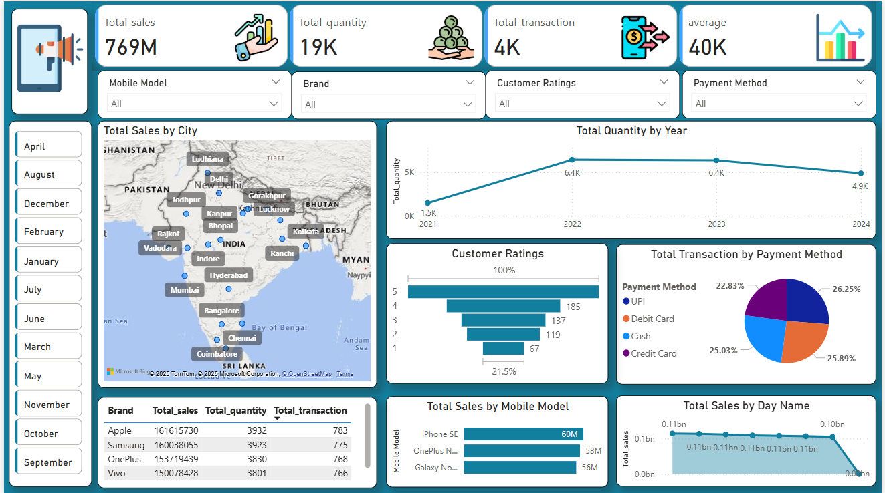

# 📱 Mobile Sales Data Dashboard – Power BI Project

This repository contains a Power BI dashboard project that visualizes mobile phone sales data with interactive charts and insights. The dashboard helps track and analyze performance across mobile models, brands, cities, customer ratings, and payment methods.

## 📊 Key Features

- 💰 **Total Sales Analysis** – Track total sales in monetary terms (769M+)
- 📦 **Total Quantity & Transactions** – Monitor the number of units sold and total customer transactions
- 🗺️ **Sales by City** – Visual representation of sales spread across cities in India
- 📆 **Monthly & Yearly Trends** – Identify sales quantity trends year-wise
- ⭐ **Customer Ratings Breakdown** – Ratings from 1 to 5 displayed with bar charts
- 💳 **Payment Method Insights** – Pie chart distribution of payment methods (UPI, Card, Cash, etc.)
- 📱 **Top Mobile Models & Brands** – Analyze the best-performing models and brands
- 📅 **Sales by Day** – Track total sales by day of the week

## 🛠️ Tools Used

- **Microsoft Power BI** – For building and visualizing the dashboard
- **DAX** – For calculated measures and KPIs
- **Power Query Editor** – For data cleaning and transformation

## 📸 Preview

## 🎓 Learning Source

This dashboard was created as part of my Power BI learning journey from **Skill Course by Satish Dhawale**. His step-by-step, real-world approach to teaching helped me confidently build dynamic and impactful dashboards.

## 📂 Files Included

- `Mobile_Sales_Dashboard.pbix` – The Power BI dashboard project file
- `dashboard.png` – Screenshot/Preview of the final dashboard
- `README.md` – Project overview and documentation

## 📬 Contact

Feel free to connect with me on [LinkedIn](https://www.linkedin.com/) or leave a ⭐ if you found this helpful!

---

#powerbi #datavisualization #salesdashboard #businessintelligence #mobiledata #skillcourse #satishdhawale #dax #powerquery #dataanalytics
